### link to site: 
https://kiminus-cse134hw3.netlify.app/

### link to github:
https://github.com/kiminus/cse134-HW3

# Purpose of site
the purpose of the site is to host my class notes about CSE 142, and explain the topics about assembly language, computer architecture history, performance optimizations, C++ templates and interpreting code from assembly.
the site intended to aid users to understand complex concepts and provide guidance on how to solve typical problems  

# Audience Considerations
Persona Diagram: 
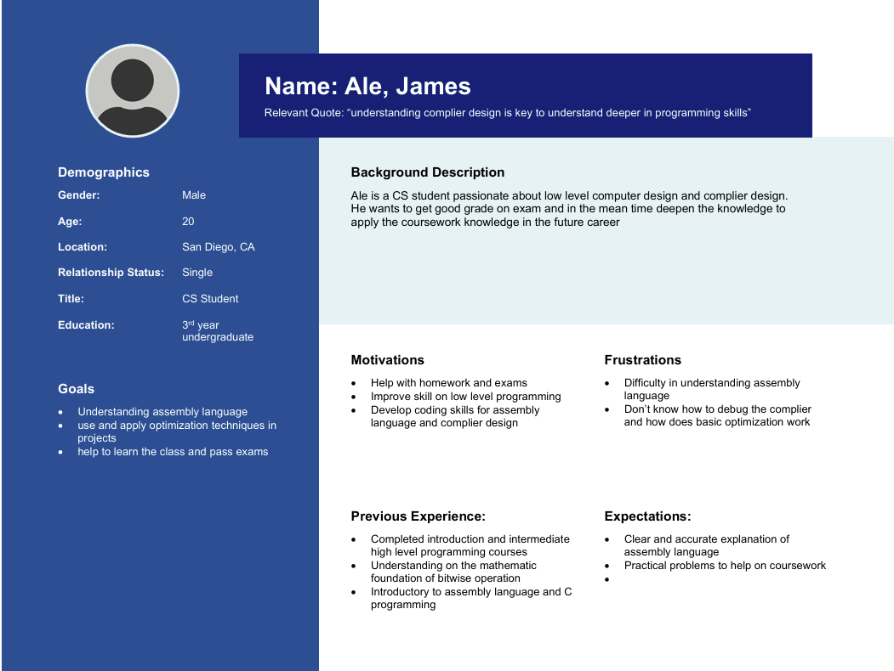
# site diagram 
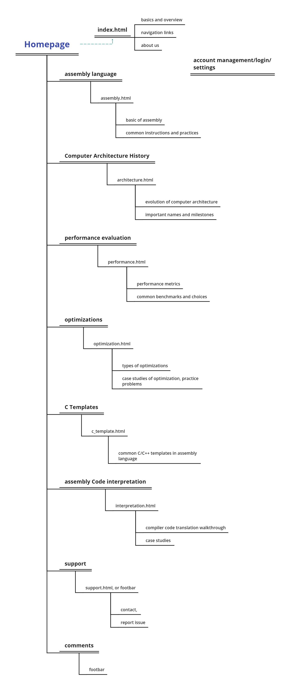
# wireframes
## Homepage Wireframe
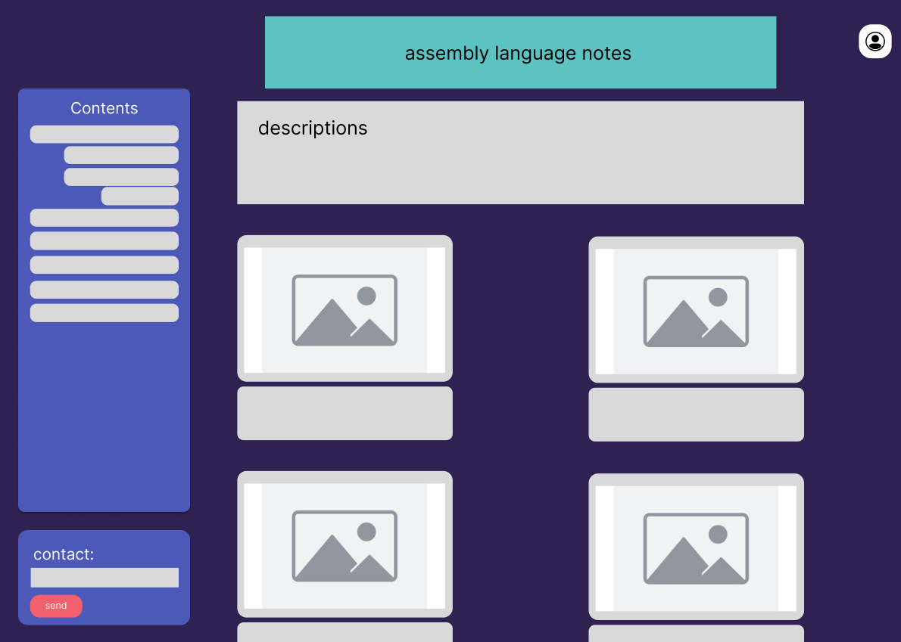   
## Common page wireframe
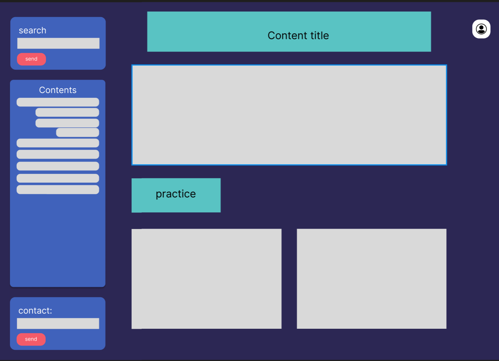
## 404 page
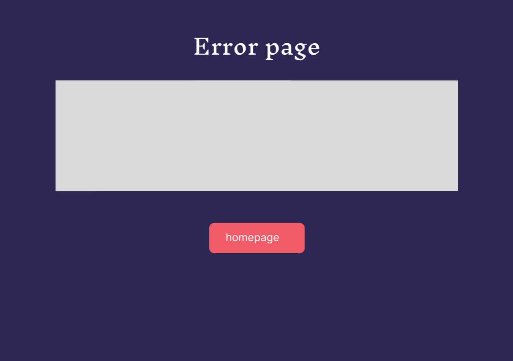
# content requirements
1. will be hosted on netlify
2. site will be built following the practice of progressive enhancement, therefore basic functionalities should be accessible and usable for users without JS/advanced CSS. the site will be using HTML for structure. in the future, we will use typescript instead of JS to ensure site reliablity and code maintainability
3. github is used for version control and future collaborations
4. target version should to latest version of chrome, or the earliest version in each browser that supports all the HTML elements implemented in part 2
5. the site is intended for laptop view, but it should feature in responsive design to support mobile device and tablets, although with limited asethetic
6. any page should be less than 10mb, since there are many images to load. 
7. the site should be accesible using only keyboard navigation

# Content requirements
1. the site should contain text content, including class notes, lecture summaries, and others
2. there will be chart and images to support learning
3. some sample questions to provide practice examples
4. external links for reference and further explaination

# Presentation Quality 
1. content side should always have a header, concept introduction, details, and practice question.
2. every site should use different level headers to provide clear format and breakdown of topics. 
3. use coolors.co to create a harmonic color scheme and more consistent color pattern
4. use w3 validator to secure code quality and correctness
5. a roadmap and wireframe to ensure the development is planned and developed according to plan
6. the content is designed for the intended audience to assist in learning 
7. the platform of presentation is primarily on laptop screen. 

# EC
### math equation 
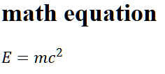
```
        <math xmlns="http://www.w3.org/1998/Math/MathML">
            <mi>E</mi>
            <mo>=</mo>
            <mi>m</mi>
            <msup>
                <mi>c</mi>
                <mn>2</mn>
            </msup>
        </math>
```
### Site Validation
here is the validation report from w3 validator 
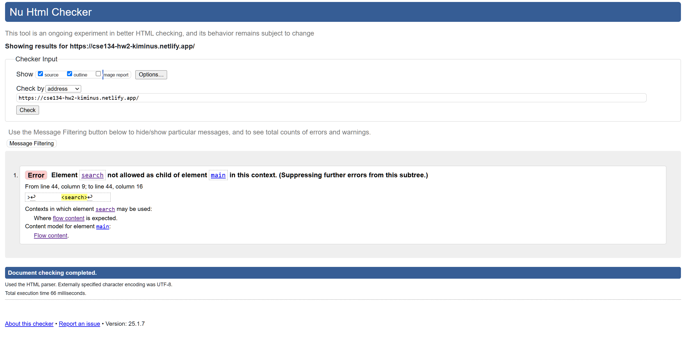

tries to validate: 
1. move search inside the body tag, still throw same error
2. move search inside the main tag, still throw same error
3. the error thrown may be due to outdated support (or the validator is not updated) to recognize and validate the search tag
4. according to the [dev site](https://developer.mozilla.org/en-US/docs/Web/HTML/Element/search), the search tag is newly introduced at 2023, so the validator may not be updated. 
5. in the dev doc, it is suggested to put search tag inside the header element, as what I did. 


### meta for search engine:

prevent robot/search engine to find this page: 
````
<meta name="keywords" content="compiler design, assembly language, C++, performance, computer architecture">
<meta property="og:title" content="Compiler Instruction & Design">
<meta name="robots" content="noindex, nofollow"> 
````

# HW3
### redo with framework
I used bootstrap framework to redo the site. what i did is essentially replace the flex display with bootstrap grid system. the rest of the site is the same.

by using the boostrap framework, each element 
here is a comparison of the two sites (no cache):

|metrics| old site (vanilla) | new site (bootstrap) |
| --- |--------------------|----------------------|
| css size | 6.34 KB            | 6.9 KB               |
| DOM Content load time (ms) | 55                 | 142                  |
| page fully loaded time (ms) | 116                | 144                  |
| number of requests | 9                  | 10                   |
| data transfered (KB) | 200                | 268                  |
| resource loaded by page (KB) | 197                | 504                  |


### cascade network flow for vanilla site:
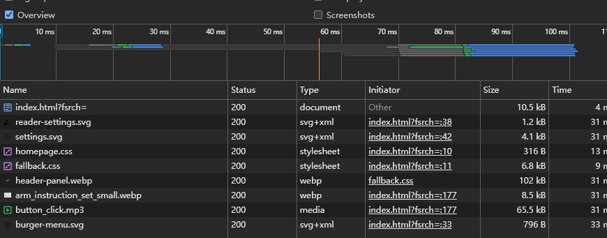

### cascade network flow for bootstrap site:
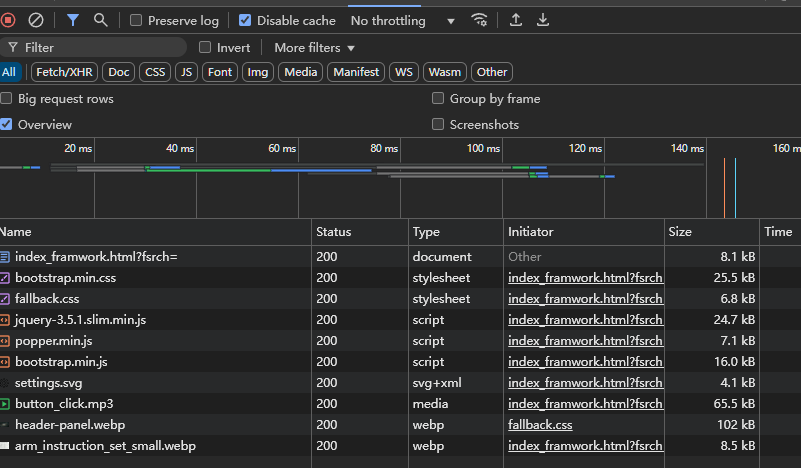

# HW4
## part 1, 2
> please check the "contact us" toggle section in the footer for the contact form implement action

### HTTP request:
```http request
POST /post HTTP/1.1
user-agent: Mozilla/5.0 (Windows NT 10.0; Win64; x64) AppleWebKit/537.36 (KHTML, like Gecko) Chrome/133.0.0.0 Safari/537.36
Host: httpbin.org
Accept-Language: en-US
Content-Type: application/x-www-form-urlencoded

name=zilin%20Liu&email=zilin%40gmail.com&comments=this%20is%20a%20test&possible_bot=true
```
### response from httpbin
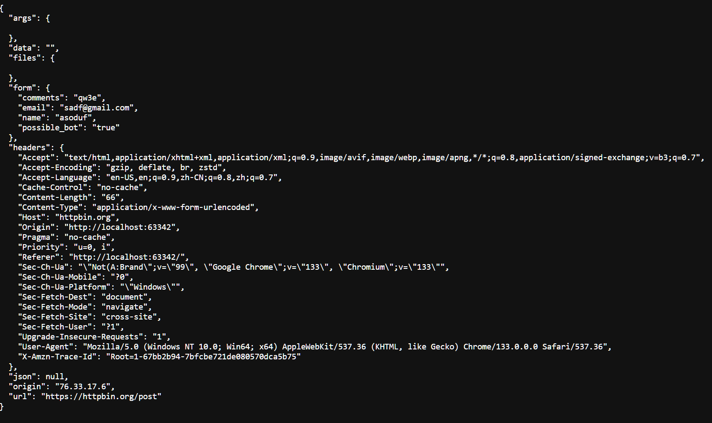
### layout
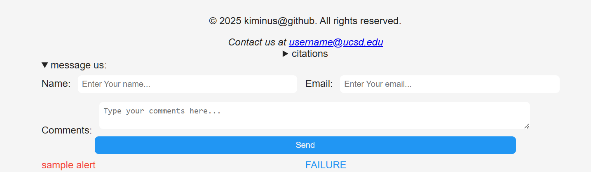